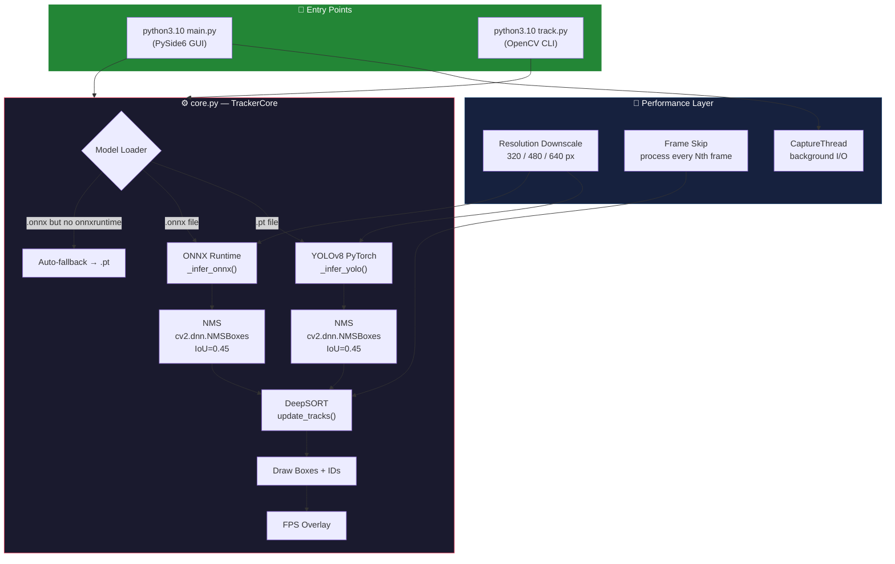
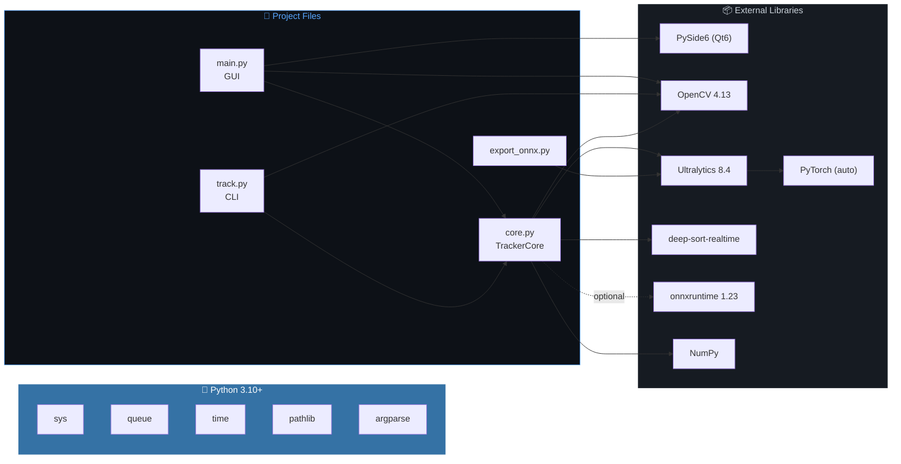
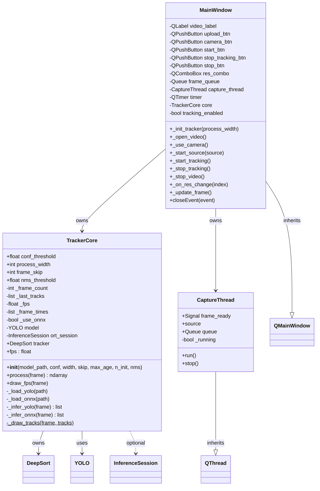
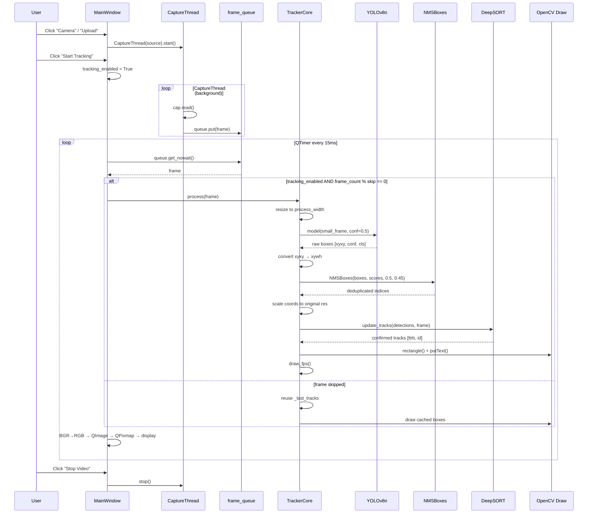
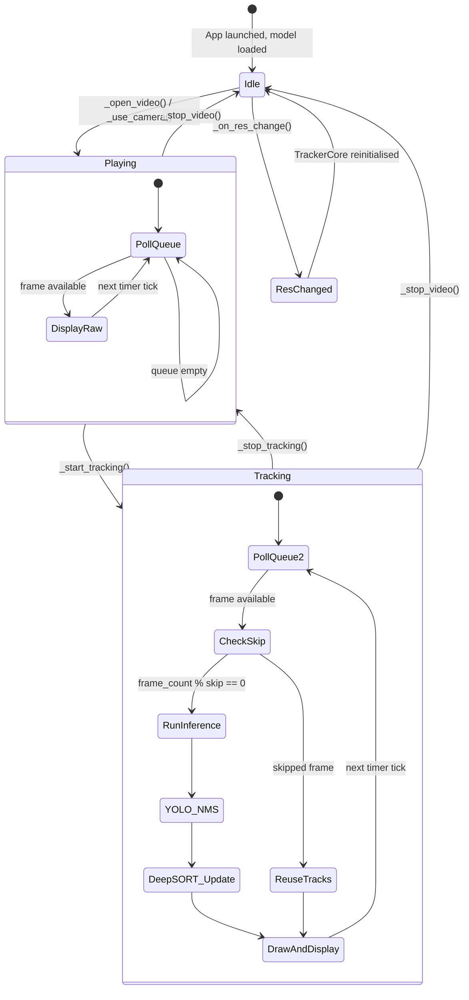
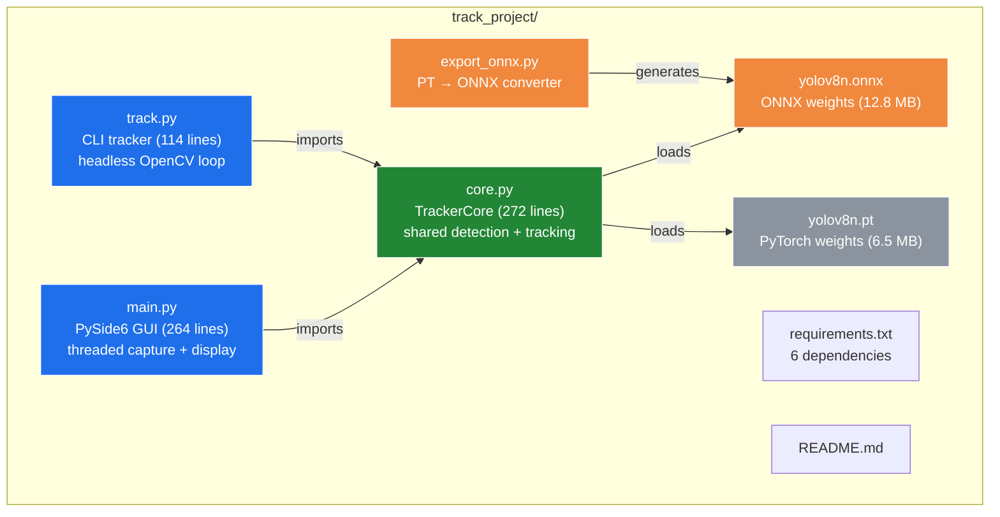

# Object Tracking System — Complete Architecture & Implementation Plan

> **YOLOv8 + DeepSORT Real-Time Multi-Object Tracker**
> Threaded GUI (PySide6) + CLI — CPU-only, ONNX-ready

---

## 1. Full System Architecture

---

## 2. Component Dependency Graph

---

## 3. Class Diagram (UML)

---

## 4. Detection Pipeline — NMS Detail

```mermaid
flowchart LR
    subgraph Input["📹 Frame In"]
        F["Raw Frame<br/>(e.g. 1920×1080)"]
    end

    subgraph Downscale["📐 Resize"]
        F --> R["cv2.resize<br/>→ process_width px"]
    end

    subgraph Detect["🔍 Detection"]
        R --> Y{"Model Type?"}
        Y -->|.pt| YP["YOLOv8 PyTorch<br/>model(frame, conf=0.5)"]
        Y -->|.onnx| YO["ONNX Runtime<br/>ort_session.run()"]
        YP --> B1["Raw Boxes<br/>[x,y,w,h] + conf + cls"]
        YO --> P["Preprocess<br/>RGB, CHW, float32, /255"]
        P --> I["Inference"]
        I --> D["Decode<br/>cx,cy,w,h → x,y,w,h"]
        D --> B2["Raw Boxes"]
    end

    subgraph NMS["🧹 NMS Dedup"]
        B1 --> N["cv2.dnn.NMSBoxes<br/>conf ≥ 0.5, IoU ≤ 0.45"]
        B2 --> N
        N --> CLEAN["Deduplicated<br/>Detections"]
    end

    subgraph Scale["📏 Rescale"]
        CLEAN --> SC["Scale coords<br/>back to original res"]
    end

    subgraph Track["🎯 DeepSORT"]
        SC --> DS["update_tracks()<br/>n_init=1, max_age=30"]
        DS --> OUT["Confirmed Tracks<br/>[ltrb, track_id]"]
    end

    style Input fill:#11111b,stroke:#45475a,color:#cdd6f4
    style Downscale fill:#1e1e2e,stroke:#45475a,color:#cdd6f4
    style Detect fill:#1a1a2e,stroke:#e94560,color:#fff
    style NMS fill:#238636,stroke:#fff,color:#fff
    style Scale fill:#1e1e2e,stroke:#45475a,color:#cdd6f4
    style Track fill:#1f6feb,stroke:#fff,color:#fff
```

---

## 5. Data-Flow Sequence Diagram

---

## 6. Application State Machine

---

## 7. Method Reference Tables

### [core.py](file:///home/adhiraj-singh/track_project/core.py) — [TrackerCore](file:///home/adhiraj-singh/track_project/core.py#26-272)

| Method | Lines | Purpose |
|---|---|---|
| [__init__](file:///home/adhiraj-singh/track_project/core.py#39-74) | 39–73 | Load model (.pt/.onnx with fallback), init DeepSORT, set thresholds |
| [_load_yolo](file:///home/adhiraj-singh/track_project/core.py#79-85) | 79–84 | Load YOLOv8 via ultralytics, force CPU |
| [_load_onnx](file:///home/adhiraj-singh/track_project/core.py#86-93) | 86–92 | Load ONNX model via onnxruntime |
| [_infer_yolo](file:///home/adhiraj-singh/track_project/core.py#98-124) | 98–123 | YOLO .pt inference → collect boxes → **NMS** → return detections |
| [_infer_onnx](file:///home/adhiraj-singh/track_project/core.py#125-171) | 125–170 | ONNX inference → decode predictions → **NMS** → return detections |
| [process](file:///home/adhiraj-singh/track_project/core.py#176-229) | 176–228 | Resize → infer (or skip) → DeepSORT → draw → FPS |
| [draw_fps](file:///home/adhiraj-singh/track_project/core.py#235-246) | 235–245 | Overlay FPS counter (top-left, cyan) |
| [_draw_tracks](file:///home/adhiraj-singh/track_project/core.py#251-272) | 251–271 | Draw green rectangles + "ID: N" labels |

### [main.py](file:///home/adhiraj-singh/track_project/main.py) — [MainWindow](file:///home/adhiraj-singh/track_project/main.py#75-254) + [CaptureThread](file:///home/adhiraj-singh/track_project/main.py#35-70)

| Method | Lines | Purpose |
|---|---|---|
| `CaptureThread.run` | 46–65 | Background thread: read frames, push to queue (drop old) |
| `CaptureThread.stop` | 67–69 | Signal thread to stop, wait for join |
| `MainWindow.__init__` | 76–162 | Build UI, init TrackerCore, wire signals |
| [_init_tracker](file:///home/adhiraj-singh/track_project/main.py#167-179) | 167–178 | Create TrackerCore (auto-detect ONNX → PT fallback) |
| [_open_video](file:///home/adhiraj-singh/track_project/main.py#183-189) | 183–188 | File dialog → start capture |
| [_use_camera](file:///home/adhiraj-singh/track_project/main.py#190-192) | 190–191 | Open webcam index 0 |
| [_start_source](file:///home/adhiraj-singh/track_project/main.py#193-201) | 193–200 | Stop old capture → start new CaptureThread + timer |
| [_update_frame](file:///home/adhiraj-singh/track_project/main.py#228-247) | 228–246 | Poll queue → process → BGR→RGB → display on QLabel |
| [closeEvent](file:///home/adhiraj-singh/track_project/main.py#251-254) | 251–253 | Clean shutdown: stop thread + timer |

### [track.py](file:///home/adhiraj-singh/track_project/track.py) — CLI

| Method | Lines | Purpose |
|---|---|---|
| [parse_args](file:///home/adhiraj-singh/track_project/track.py#19-55) | 19–54 | CLI flags: --source, --model, --conf, --process-width, --frame-skip |
| [resolve_model](file:///home/adhiraj-singh/track_project/track.py#57-67) | 57–66 | Auto-pick .onnx if exists, else .pt |
| [run_tracker](file:///home/adhiraj-singh/track_project/track.py#69-105) | 69–104 | Main loop: read → process → display → quit on 'q' |

---

## 8. Key Parameters

| Parameter | Default | Effect |
|---|---|---|
| `conf_threshold` | **0.5** | Higher = fewer false positives, fewer duplicate boxes |
| `nms_threshold` | **0.45** | IoU overlap limit — boxes above this are merged |
| `process_width` | **480** | Inference resolution — smaller = faster, less precise |
| `frame_skip` | **2** | Run YOLO every 2nd frame — doubles effective FPS |
| `n_init` | **1** | Track confirmed on first match (required for frame_skip > 1) |
| `max_age` | **30** | Frames before a lost track is deleted |

---

## 9. Project File Map

---

## 10. Tech Stack

| Layer | Technology | Version |
|---|---|---|
| Language | Python | 3.10+ |
| Detection | Ultralytics YOLOv8n | 8.4 |
| Tracking | deep-sort-realtime (Kalman + ReID) | 1.3+ |
| NMS | cv2.dnn.NMSBoxes | — |
| Inference (fast) | ONNX Runtime | 1.23 |
| Inference (fallback) | PyTorch (CPU) | auto |
| GUI | PySide6 (Qt6) | 6.11 |
| Video I/O | OpenCV | 4.13 |
| Numerics | NumPy | 1.24+ |
